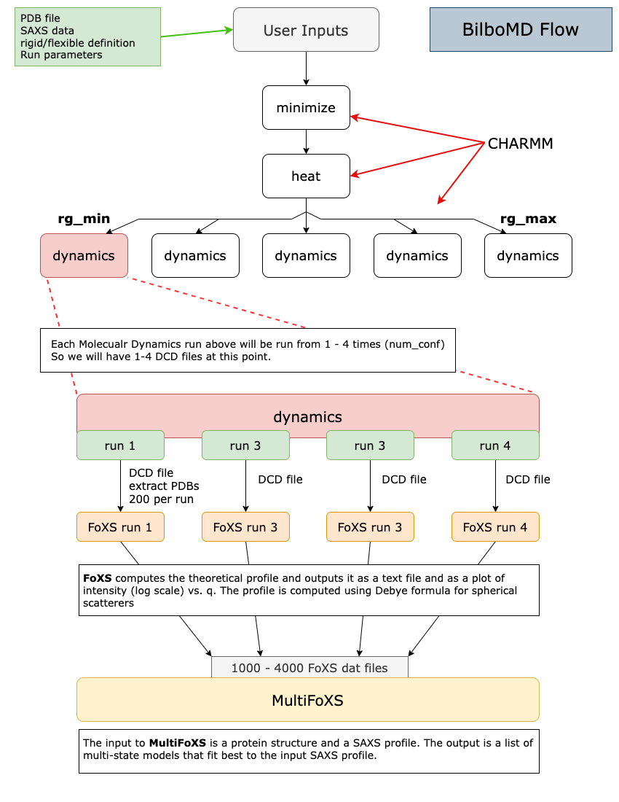

# bilbomd-worker

Processes BilboMD jobs and run CHARMM, FoXS, and MultiFoXS

## `bilbomd-worker` Description

`bilbomd-worker` is a simple [Typescript](https://www.typescriptlang.org/) NodeJS "worker" app that watches a BullMQ queue for incoming jobs. When a new job appears in the queue it will launch a sequence of processing tasks using CHARMM, FoXS, and MultiFoXS. The results will then be bundled up as a `results.tar.gz` file. The job progress will be updated in the main MongoDB database as well as in the BullMQ system (which uses Redis behind the scenes to store queue data).

## BilboMD processing pipeline



## Deployment

To build the Docker image from the command line you must specify the CHARMM version.

```bash
docker build -t bl1231/bilbomd-worker:0.0.12-dev1 --build-arg CHARMM_VER=c47b2 .
```

The entire app is run within a [Docker](https://www.docker.com/) container. See the `Dockerfile` for details. It accesses BullMQ/Redis container using these env variables:

```bash
REDIS_URL=bilbomd-redis:6379
REDIS_HOST=bilbomd-redis
REDIS_PORT=6379
REDIS_PASSWORD=XXXXXXXXXXXXXXXXXXXXX
```

and the MongoDB container with these:

```bash
MONGO_PASSWORD=XXXXXXXXXXXXXXXXXXXXX
MONGO_HOSTNAME=hyperion.bl1231.als.lbl.gov
MONGO_PORT=27017
MONGO_DB=bilbomd
MONGO_AUTH_SRC=admin
```

All of these env settings (and some others) reside in a single `.env` file that is used by Docker Compose to build the suite of 4 services. This will be documented elsewhere. But for posterity they are:

- bilbomd-worker (this project)
- [bilbomd-backend](https://github.com/bl1231/bilbomd-backend)
- [bilbomd-mongodb](https://hub.docker.com/_/mongo) (official docker image from [Docker Hub](https://hub.docker.com/))
- [bilbomd-redis](https://hub.docker.com/_/redis)(official docker image [Docker Hub](https://hub.docker.com/))

## Version History

- 1.3.1
  - Close fs streams properly so we don't have dangling NFS lock files.
- 1.3.0
  - Add new functions to run `FoXS` analysis on initial PDB for BilboMD classic/auto
- 1.2.9
  - Add a README file to all `results.tar.gz` files explaining the contents.
- 1.2.8
  - Fix bug when `rg_min` and `rg_max` are too close.
- 1.2.7
  - Update dependencies
- 1.2.6
  - Synchronize `mongoose` schema files with other BilboMD codes
- 1.2.5
- Change all CHARMM bomlev values to `-2``
- 1.2.4
  - Upgrade mongoose from 7.6.3 to 8.0.2
- 1.2.3
  - add the hidden `-o` option for all `multi_foxs` runs
- 1.2.2
  - update `pae_ratios.py` script
- 1.2.1
  - Small change to logging messages
- 1.2.0
  - Refactor bilbomd function code
  - Add single `handleError` function
  - improve error handling logic
- 1.1.0
  - Rewrite gatherResults
  - Return single PDB file for each MultiFoXS ensemble
- 1.0.0
  - Start using Ubuntu for Docker build
  - IMP 2.19.0
- 0.0.12
  - Add BilboMDAuto job type (experimental and untested!)
- 0.0.11
  - bump nodejs to 18.18.0
- 0.0.10
  - Remove the `-r` option from FoXS in `spawnFoXS` function.
- 0.0.9
  - add job title to emails
